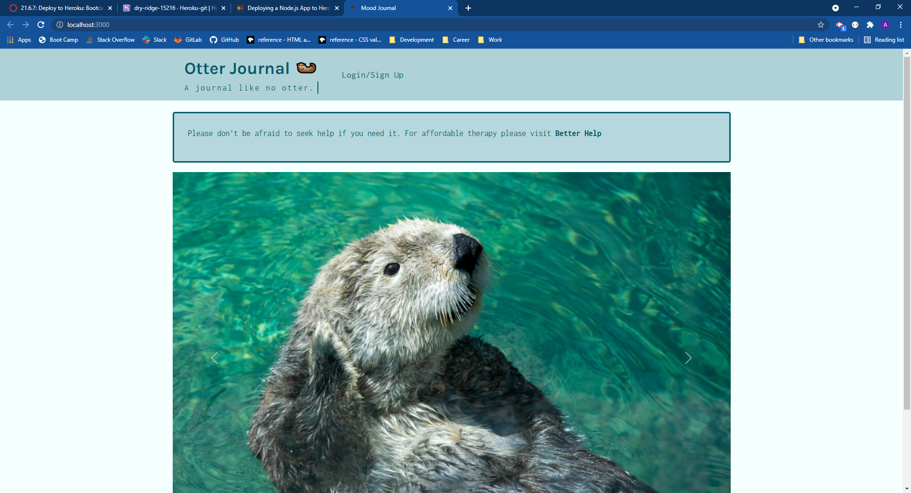

# Interactive MERN SPA Project 
#Mood Journal

## Description 

Interactive MERN SPA-Project: Mood Journal

An app that allows the user to journal thier daily activity and mood, with a text entry for discusion. They can get a daily affirmation if they are needing help with finding something to discuss. Also they can pull up a chart to see the interaction of thier behavior and mood.  Alink is provided if they feel like extending this excercise to get professional help.

Challenge Elements
The group will use everything you’ve learned throughout this course to create a MERN stack single-page application that works with real-world data to solve a real-world challenge, with a focus on user demand. The user story and acceptance criteria will depend on the project that you create, but your project must fulfill some specific requirements. 

Technologies Used  
●HTML/CSS/Git 
●JavaScript 
●ant-design/icons: 4.7.0 
●apollo-server-express: 3.3.0 
●bcrypt: 5.0.1 
●bootstrap: 5.1.3 
●chart.js: 3.6.0 
●express: 4.17.1 
●faker: 4.1.0 
●graphql: 15.5.0 
●hooks: 0.3.2 
●jquery: 3.6.0 
●jsonwebtoken: 8.5.1 
●jwt-decode: 3.1.2 
●mongoose: 5.9.9 
●react: 17.0.2 
●react-bootstrap: 2.0.2 
●react-chartjs-2: 3.3.0 
●react-dom: 17.0. 
●react-router-dom: 5.2.0 
●react-scripts: 4.0.3 
●web-vitals: 1.0.1

our project should fulfill the following requirements:

  [X]  Use React for the front end. 
  [X]  Use GraphQL with a Node.js and Express.js server. 
  [X]  Use MongoDB and the Mongoose ODM for the database. 
  [X]  Use queries and mutations for retrieving, adding, updating, and deleting data. 
  [X]  Be deployed using Heroku (with data). 
  [X]  Have a polished UI. 
  [X]  Be responsive. 
  [X]  Be interactive (i.e., accept and respond to user input). 
  [X]  Include authentication (JWT). 
  [X]  Protect sensitive API key information on the server. 
  [X]  Have a clean repository that meets quality coding standards (file structure, naming conventions, best practices for class and id naming conventions, indentation, quality comments, etc.). 
  [X]  Have a high-quality README (with unique name, description, technologies used, screenshot, and link to deployed application). 
 

## Installation

The project can be viewed at: https://mood-journal.herokuapp.com/  
The projects code can be accessed at: https://github.com/AWiebe2021/mood-journal

## Screenshot

## Credits
Team 1
Aaron Wiebe - https://awiebe2021.github.io/awiebe-portfolio/  
Valeria Mercado - https://sxwqsd.github.io/  
